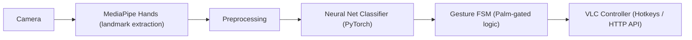

# 🎯 VLC Hand Gesture Controled  
[](https://www.python.org/)  [](https://pytorch.org/)  [](https://developers.google.com/mediapipe)  [](https://opencv.org/)  

**Gesture-controlled VLC using MediaPipe + Neural Network**  


## 📺 Demo
*(Add a GIF or screenshot here)*  
```bash
python main.py
```

---

## ✋ Features
| Gesture        | Action            | Trigger type         |
| -------------- | ----------------- | -------------------- |
| palm           | base/activation   | gating/activation    |
| fist           | play/pause toggle | one-shot per session |
| two_fingers    | mute/unmute       | one-shot per session |
| finger_up      | volume up         | continuous           |
| finger_down    | volume down       | continuous           |

> **Note:** `palm` arms the system for the next gesture.

---

## 🛠 How It Works (Architecture)

- **One-shot**: `fist`, `two_fingers` — triggered once per palm session.  
- **Continuous**: `finger_up`, `finger_down` — repeat until palm shown again or hand removed.

---

## 🎬 VLC Media Player Setup (Step-by-step)

### 1. Install VLC (Windows)
Download: [VLC Official Site](https://www.videolan.org/vlc/)  

### 2. Enable Control

#### **a) Hotkeys** *(default fallback)*  
- Space → Play/Pause  
- ↑ / ↓ → Volume Up/Down  
- M → Mute/Unmute  

#### **b) HTTP Interface** *(recommended for precision)*  
1. Open VLC → Tools → Preferences → Show All (bottom-left).  
2. Interface → Main Interfaces → Check **Web**.  
3. Expand Main Interfaces → **Lua** → Set *Lua HTTP* password (`vlcpassword` default).  
4. Default port: `8080`.  
5. Launch VLC with HTTP enabled:  
   ```bash
   vlc --intf http --http-password vlcpassword
   ```
6. Test: Visit `http://localhost:8080` in browser.

### 🔧 Troubleshooting
- **Port busy**: Change VLC HTTP port in preferences.  
- **Firewall**: Allow VLC through firewall.  
- **HTTP Auth errors**: Check password in `.env` or `vlc_controller.py`.

---

## 💻 Project Installation & Setup
```bash
# Clone repo
git clone <your_repo_url>
cd <repo_name>

# (Recommended) Create virtual environment
python -m venv venv
venv\Scripts\activate  # Windows
# source venv/bin/activate  # Linux/macOS

# Install dependencies
pip install -r requirements.txt
```
**Core dependencies:**  
```bash
pip install opencv-python mediapipe torch joblib psutil pyautogui requests
```

Verify:
```python
import torch; print(torch.cuda.is_available())  # True if GPU available
```

---

## 📦 Model: Training & Data Collection
1. **Collect data**:  
```bash
python code/train_model.py
```
- `c` → capture sample  
- `n` → skip to next gesture  
- `ESC` → exit early  

2. **Augmentation**: Random rotation, scale, noise (`AUGMENTATION_FACTOR=5`).  

3. **Train model**:  
- Defaults: `epochs=50`, `batch_size=32`, `lr=0.001`  
- Outputs:  
  - `models/gesture_model.pth`  
  - `models/gesture_labels.pkl`  

Tips:
- Collect data at multiple distances and lighting conditions.  
- Ensure balanced samples for each gesture.

---

## 👀 Test/Preview: Live Recognition
```bash
python code/recognize.py
```
Overlay shows:
- Predicted gesture
- FPS
- Confidence score (if implemented)

Press **ESC** to quit.  
If unstable → collect more data, adjust `min_detection_confidence`.

---

## 🎯 VLC Control Runtime
```bash
python main.py
```
Flow:
1. Detect VLC session via `psutil` + HTTP API.  
2. Prompt user for webcam activation.  
3. Launch `gesture_vlc.py` for live control.

Palm → Action mapping:
- Palm → Fist → Play/Pause  
- Palm → Two fingers → Mute/Unmute  
- Palm → Finger up → Volume up (continuous)  
- Palm → Finger down → Volume down (continuous)  

---

## ⚙ Configuration
Variables in code:
```python
# vlc_controller.py
vlc_http_url = "http://localhost:8080/requests"
vlc_http_auth = ("", "vlcpassword")
volume_step = 5
continuous_step = 2
```
Optional `.env`:
```env
VLC_HOST=localhost
VLC_PORT=8080
VLC_PASSWORD=vlcpassword
CAMERA_INDEX=0
```

---

## 📂 File-by-File Explanation
- **train_model.py** — Data collection + augmentation + training loop. Saves model & labels.  
- **recognize.py** — Loads model, previews predictions via webcam.  
- **gesture_vlc.py** — Core recognition & state machine. Maps gestures to VLC commands.  
- **vlc_controller.py** — Sends commands to VLC via HTTP or keyboard.  
- **main.py** — Monitors VLC process, launches gesture control when active.

---

## 🚀 Performance Tips & Tuning
- Use GPU (`torch.cuda.is_available()`) for faster inference.  
- Reduce frame size in `cv2.VideoCapture` for lower latency.  
- Adjust `min_detection_confidence` in MediaPipe for stability.  
- Smooth predictions using temporal averaging.

---

## 🛠 Troubleshooting & FAQ
| Problem | Solution |
| ------- | -------- |
| MediaPipe install fails | Install from official wheel. |
| Camera not opening | Check permissions, close other apps. |
| CUDA not available | Install matching PyTorch GPU build. |
| VLC HTTP not responding | Check password/port in preferences. |
| Gesture flicker | Collect more data, increase `min_confidence_frames`. |

---

## 🔒 Security & Privacy
- Webcam only activates after user consent.  
- No images or videos stored by default.  
- All inference local — no cloud calls.

---

## 🗺 Roadmap / Ideas
- Add new gestures  
- Per-application profiles  
- Multi-hand support  
- On-screen HUD overlay  
- Calibration wizard


## 🙏 Acknowledgements
- [MediaPipe Hands](https://developers.google.com/mediapipe)  
- [PyTorch](https://pytorch.org/)  
- [OpenCV](https://opencv.org/)  
- [VLC](https://www.videolan.org/vlc/)
